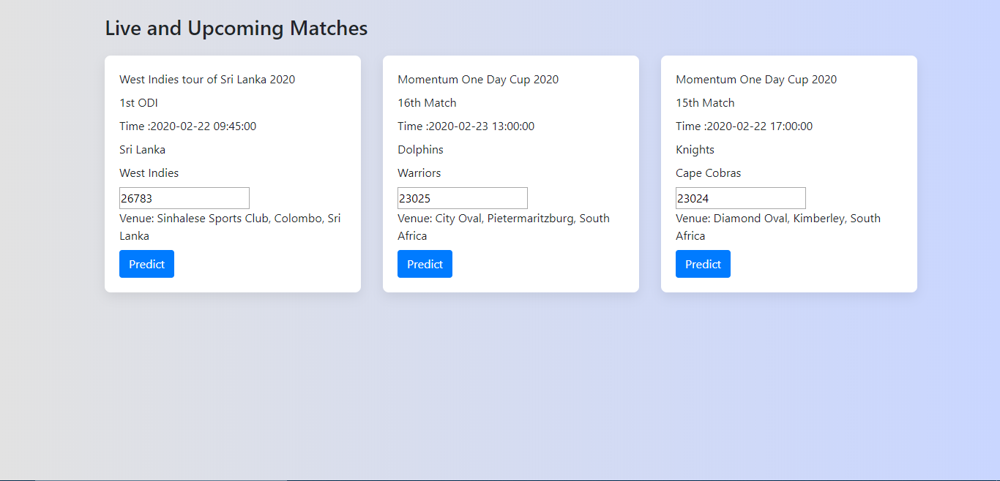
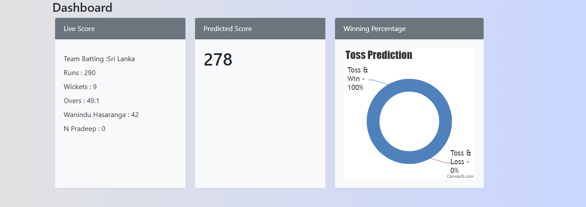
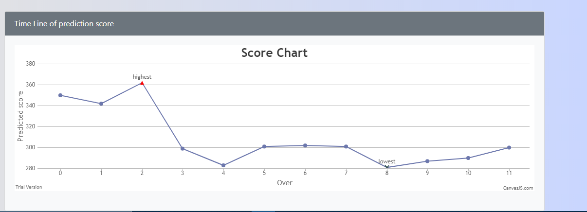
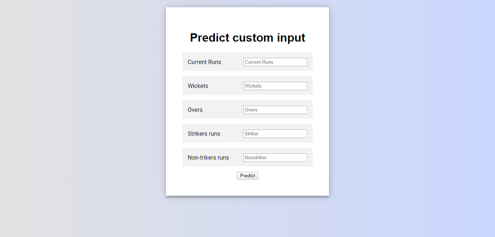

# ScorePredict
Project made in DJACM-LOC 2020  
Cricket Analytics and Betting  
Cricket Analytics helps to predict the target score by not only viewing the run rate but also checking various other factors like wickets left,runs scored,overs left and players playing on field    

The problem Cricket Analytics and Betting solves   
Currently only run rate is viewed for predicting the score but predicting the score by using various other factors like wickets left in hand, players playing on field,run scored and overs left in hand.Viewing the pitch and toss wining also makes our system more effective and accurate .This prediction helps the team to organize accordingly.And our add on feature that is using Blockchain technology helps to make the betting in cricket official plus secured and any one can bet on the team and if the team wins on which user have batted get the benefits.
  
Challenges we ran into  
Finding the datasets,Training the model,integrating all the things together and using blockchain technology for betting .  
  
Technology used:  
HTML, Bootstrap, CSS, JavaScript, Flask, scikit-learn, Python, Remix IDE, Blockchain(Ethereum), Solodity  
  
Screenshots:  
  
  
    
  
  
  
  
  
  

